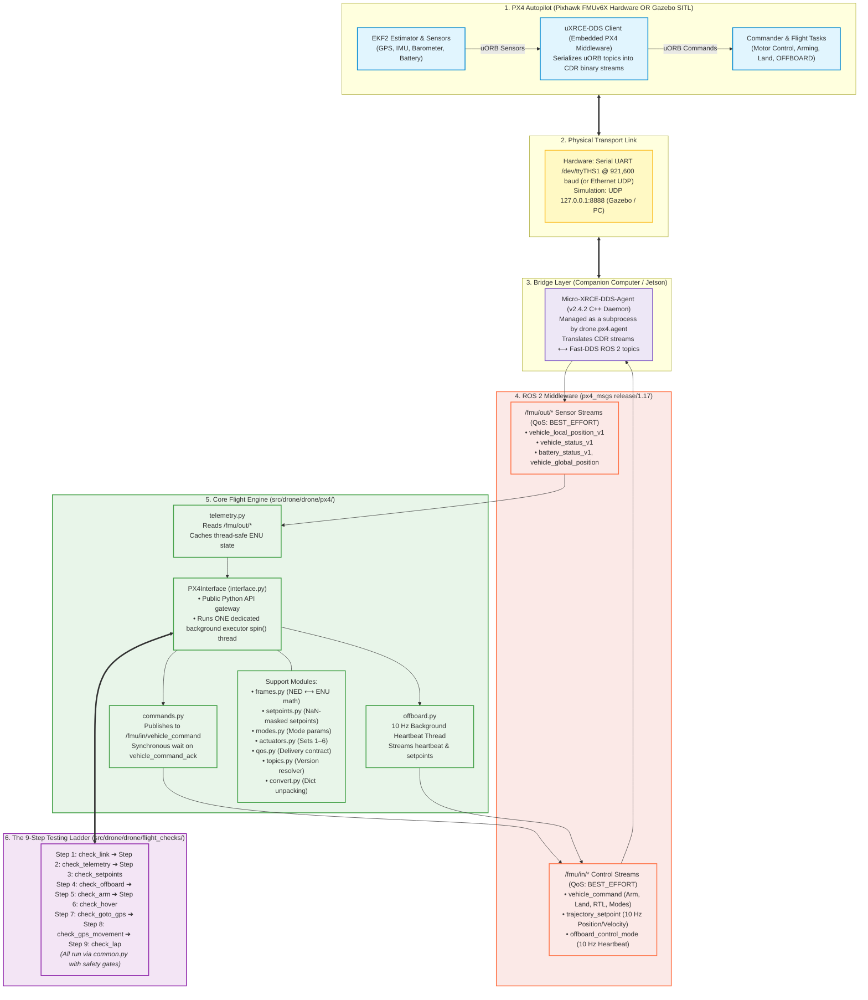

# System Architecture & Technical Deep-Dive

This document details the software and hardware architecture of `drone-2027`. It explains how the companion computer (NVIDIA Jetson or simulated workstation) interfaces with the PX4 Autopilot through the **uXRCE-DDS bridge**, how ROS 2 manages flight data, and exactly what each file in the repository is responsible for.

---

## 1. System Architecture Flowchart

The flowchart below traces the linear pipeline from hardware sensors on the Pixhawk, across the transport link and DDS bridge, into our ROS 2 flight engine, and up to the 9-step testing ladder:



---

## 2. ASCII System Architecture Blueprint

This diagram shows the complete hardware and software topology, highlighting **which file takes care of what** across each layer of the stack:

```text
┌────────────────────────────────────────────────────────────────────────────────────────┐
│                                   PX4 AUTOPILOT                                        │
│  (Pixhawk FMUv6X hardware running PX4 v1.17.0 firmware OR px4_sitl in Gazebo)          │
│                                                                                        │
│  uORB Topics (Aviation NED coordinates):                                              │
│    OUTBOUND (Sensors & State):                 INBOUND (Commands & Setpoints):         │
│    • vehicle_status / vehicle_status_v1        • vehicle_command                       │
│    • vehicle_local_position_v1                 • offboard_control_mode                 │
│    • vehicle_global_position                   • trajectory_setpoint                   │
│    • battery_status                                                                    │
│    • vehicle_command_ack                                                               │
│                           ▲                              │                             │
│                           │                              ▼                             │
│  ┌──────────────────────────────────────────────────────────────┐                      │
│  │                    uXRCE-DDS Client (PX4)                    │                      │
│  │   Serializes uORB structs to CDR byte streams over link      │                      │
│  └──────────────────────────────────────────────────────────────┘                      │
└─────────────────────────────────┬──────────────────────────────────────────────────────┘
                                  │
                   Physical Transport Layer
       Hardware: Serial UART (/dev/ttyTHS1 @ 921600 baud) or Ethernet UDP
       Simulation (SITL): UDP 127.0.0.1:8888
                                  │
┌─────────────────────────────────▼──────────────────────────────────────────────────────┐
│                  COMPANION COMPUTER (NVIDIA Jetson / Linux Workstation)                │
│                                                                                        │
│  ┌──────────────────────────────────────────────────────────────┐                      │
│  │ Micro-XRCE-DDS-Agent (v2.4.2 C++ Daemon)                     │                      │
│  │ Managed by: agent.py  [Starts/stops bridge subprocess]       │                      │
│  └──────────────────────────────┬───────────────────────────────┘                      │
│                                 │ Fast-DDS Middleware                                  │
│                                 ▼                                                      │
│  ┌──────────────────────────────────────────────────────────────┐                      │
│  │ ROS 2 Middleware (px4_msgs release/1.17 submodule)           │                      │
│  │ Configured by: qos.py     [PX4_QOS: BEST_EFFORT delivery]    │                      │
│  │ Topic names by: topics.py [Resolves _v1 suffix in 1.17]      │                      │
│  └──────────────────────────────┬───────────────────────────────┘                      │
│                                 │                                                      │
│  ═══════════════════════════════╪════════════════════════════════════════════════════  │
│                                 │                                                      │
│  OUR PYTHON ROS 2 FLIGHT ENGINE (src/drone/drone/px4/)                                 │
│                                                                                        │
│  ┌──────────────────────────────────────────────────────────────────────────────────┐  │
│  │ interface.py [PX4Interface: Central gateway & API class]                         │  │
│  │ Spawns ONE daemon thread: SingleThreadedExecutor.spin() (fixes 2026 race crash)  │  │
│  │                                                                                  │  │
│  │  ┌─────────────────────────┐  ┌───────────────────────┐  ┌────────────────────┐  │  │
│  │  │ telemetry.py            │  │ commands.py           │  │ offboard.py        │  │  │
│  │  │ [Sensor Subscriptions]  │  │ [Command & Ack Sender]│  │ [10 Hz Heartbeat]  │  │  │
│  │  │                         │  │                       │  │                    │  │  │
│  │  │ Reads: /fmu/out/*       │  │ Writes:               │  │ Writes (10 Hz):    │  │  │
│  │  │ Caches safe getters:    │  │  • vehicle_command    │  │  • offboard_mode   │  │  │
│  │  │  get_location()         │  │ Reads:                │  │  • trajectory_     │  │  │
│  │  │  get_gps_location()     │  │  • vehicle_command_ack│  │    setpoint        │  │  │
│  │  │  get_battery_status()   │  │                       │  │                    │  │  │
│  │  │  is_armed(), get_mode() │  │ Methods:              │  │ Methods:           │  │  │
│  │  │                         │  │  arm_vehicle()        │  │  start_offboard()  │  │  │
│  │  │ Decodes via:            │  │  disarm_vehicle()     │  │  send_position_... │  │  │
│  │  │  • convert.py           │  │  takeoff(), land()    │  │  send_velocity_... │  │  │
│  │  │    (unpacks structs)    │  │  change_mode("RTL")   │  │  hold_current_...  │  │  │
│  │  │                         │  │                       │  │                    │  │  │
│  │  │ Converts via:           │  │ Uses:                 │  │ Uses:              │  │  │
│  │  │  • frames.py            │  │  • modes.py (enums)   │  │  • setpoints.py    │  │  │
│  │  │    (NED -> ENU math)    │  │  • actuators.py (187) │  │    (NaN-masking)   │  │  │
│  │  │                         │  │                       │  │  • frames.py       │  │  │
│  │  │                         │  │                       │  │    (ENU -> NED)    │  │  │
│  │  └────────────▲────────────┘  └───────────▲───────────┘  └─────────▲──────────┘  │  │
│  └───────────────┼───────────────────────────┼────────────────────────┼─────────────┘  │
│                  │                           │                        │                │
│  ════════════════╪═══════════════════════════╪════════════════════════╪══════════════  │
│                  │                           │                        │                │
│  THE 9-STEP TESTING LADDER (src/drone/drone/flight_checks/)                            │
│                                                                                        │
│  ┌──────────────────────────────────────────────────────────────────────────────────┐  │
│  │ common.py: Shared link parser, connect(), safe RC arming, and shutdown cleanup   │  │
│  └───────────────────────────────────────────┬──────────────────────────────────────┘  │
│                                              │                                         │
│   [BENCH CHECKS: Steps 1-5]                  │   [FLIGHT CHECKS: Steps 6-9]            │
│   • Step 1: check_link.py                    │   • Step 6: check_hover.py              │
│   • Step 2: check_telemetry.py               │   • Step 7: check_goto_gps.py           │
│   • Step 3: check_setpoints.py               │   • Step 8: check_gps_movement.py       │
│   • Step 4: check_offboard.py                │   • Step 9: check_lap.py                │
│   • Step 5: check_arm.py                     │                                         │
└────────────────────────────────────────────────────────────────────────────────────────┘
```

---

## 3. File Responsibility Directory

A breakdown of each file's role, its inputs and outputs, and its position in the system:

### Core Flight Engine (`src/drone/drone/px4/`)

| File | Primary Responsibility | What It Reads / Subscribes | What It Writes / Publishes | Key APIs & Functions |
| :--- | :--- | :--- | :--- | :--- |
| **`interface.py`** | Central gateway node and single-threaded executor manager. | Inherits all mixins | Dispatches callbacks | `init_px4()`, `shutdown_px4()`, `PX4Interface` |
| **`telemetry.py`** | Inbound sensor streaming, thread-safe caching, EKF checks. | `/fmu/out/*` sensor topics | Updates internal cache | `get_location()`, `get_gps_location()`, `is_armed()` |
| **`commands.py`** | Synchronous vehicle command sender and ack listener. | `/fmu/out/vehicle_command_ack` | `/fmu/in/vehicle_command` | `arm_vehicle()`, `disarm_vehicle()`, `takeoff()`, `land()` |
| **`offboard.py`** | 10 Hz heartbeat streaming and offboard setpoint publisher. | Current target setpoint | `trajectory_setpoint`, `offboard_control_mode` | `start_offboard()`, `send_position_setpoint()` |
| **`frames.py`** | Pure coordinate transformation math (NED $\leftrightarrow$ ENU). | None (Pure Python) | None (Pure Python) | `ned_to_enu()`, `enu_to_ned()`, `wrap_pi()` |
| **`setpoints.py`** | Setpoint packet formatting and axis NaN-masking. | None (Pure Python) | None (Pure Python) | `position_setpoint()`, `velocity_setpoint()` |
| **`modes.py`** | Mode enum translation and command integer mapping. | None (Pure Python) | None (Pure Python) | `mode_command()`, `normalize_mode_name()` |
| **`actuators.py`** | Maps PWM inputs onto Actuator Sets 1–6 (MAV_CMD 187). | None (Pure Python) | None (Pure Python) | `actuator_command_params()`, `pwm_to_actuator()` |
| **`qos.py`** | Defines the DDS Quality of Service contract (`PX4_QOS`). | None (ROS 2 config) | None (ROS 2 config) | `PX4_QOS` (Best Effort + Transient Local) |
| **`topics.py`** | Dynamic message version topic resolver (e.g. `_v1`). | `MESSAGE_VERSION` attribute | Clean topic strings | `in_topic()`, `out_topic()`, `versioned_name()` |
| **`agent.py`** | MicroXRCEAgent subprocess manager and CLI parser. | Command line flags | Spawns C++ agent process | `add_link_args()`, `start_agent_from_args()` |
| **`convert.py`** | Decodes raw ROS message structs into clean Python dicts. | Raw `px4_msgs` structs | Dicts with validity checks | `local_position_enu()`, `battery()`, `heading_enu()` |

---

### Verification Ladder (`src/drone/drone/flight_checks/`)

| File | Step | Risk Level | What It Verifies |
| :--- | :---: | :---: | :--- |
| **`common.py`** | Shared | — | Shared CLI parser (`--sitl`, `--serial`, `--api`), connection handshake, and safe arming rules. |
| **`check_link.py`** | **Step 1** | Zero | Confirms `MicroXRCEAgent` is running and PX4 is actively publishing into ROS 2. |
| **`check_telemetry.py`** | **Step 2** | Zero | Prints live telemetry and verifies EKF health, GPS fix, and coordinate axes before moving. |
| **`check_setpoints.py`** | **Step 3** | Zero | Dry-runs position and velocity setpoints without arming; confirms ENU $\leftrightarrow$ NED conversion on the wire. |
| **`check_offboard.py`** | **Step 4** | Zero | Tests the 10 Hz heartbeat handshake and verifies that PX4 accepts and maintains OFFBOARD mode. |
| **`check_arm.py`** | **Step 5** | Low | Verifies the motor arm/disarm interlock. *(Props removed on bench; RC switch on hardware).* |
| **`check_hover.py`** | **Step 6** | Medium | The first flight check: arms, takes off to 3m, hovers rock-steady for 10s, auto-lands, and disarms. |
| **`check_goto_gps.py`** | **Step 7** | Medium | Takes off, resolves a GPS target coordinate to the local frame, navigates to it, and lands. |
| **`check_gps_movement.py`**| **Step 8** | High | Takes off, flies to a GPS target while pointing the drone's nose in the direction of flight, and lands. |
| **`check_lap.py`** | **Step 9** | High | Flies a complete polygonal airfield perimeter lap using smooth velocity control, followed by Return-To-Launch (RTL). |

---

## 4. Coordinate Transformations (`frames.py`)

Aviation autopilots and robotics software use different physical conventions. `drone-2027` isolates all conversions to [`src/drone/drone/px4/frames.py`](../src/drone/drone/px4/frames.py):

* **NED (North, East, Down):** Native PX4 aviation coordinate frame.
  * $+X$ points North
  * $+Y$ points East
  * $+Z$ points Down towards the center of the Earth (Altitude is $-Z$)
  * Yaw is $0^\circ$ facing North, rotating clockwise ($+90^\circ$ East).
* **ENU (East, North, Up):** Standard ROS 2 robotics frame (REP 103).
  * $+X$ points East
  * $+Y$ points North
  * $+Z$ points Up into the sky (Altitude is $+Z$)
  * Yaw is $0^\circ$ facing East, rotating counter-clockwise ($+90^\circ$ North).

### Exact Conversion Formulas

```text
Position Conversion:
-------------------------------------------------------------
East  (X_enu) =  North (Y_ned)
North (Y_enu) =  East  (X_ned)
Up    (Z_enu) = -Down  (Z_ned)

Velocity Conversion:
-------------------------------------------------------------
Vx_enu =  Vy_ned
Vy_enu =  Vx_ned
Vz_enu = -Vz_ned

Yaw / Heading Conversion:
-------------------------------------------------------------
Yaw_enu = 90° - Heading_ned   (normalized to [-π, +π])

Yaw Rate Conversion:
-------------------------------------------------------------
YawRate_enu = -YawRate_ned    (counter-clockwise vs. clockwise)
```

---

## 5. Detailed Data Flow Pipelines

### Pipeline A: Inbound Telemetry Flow (Sensor to Python Getter)

```text
[Pixhawk IMU / GPS / Barometer]
         │ (Physical sensor interrupts on microcontroller)
         ▼
[PX4 Autopilot: EKF2 State Estimator]
         │ (Publishes internal uORB topic: vehicle_local_position)
         ▼
[PX4 uXRCE-DDS Client]
         │ (Encodes into CDR binary stream over Serial UART / UDP)
         ▼
[MicroXRCEAgent (Fast-DDS Bridge)]
         │ (Translates to ROS 2 topic: /fmu/out/vehicle_local_position_v1)
         ▼
[PX4Interface: Dedicated Executor Spin Thread]
         │ (Runs the store callback made by TelemetryMixin._make_store_callback)
         ▼
[Latest raw message: self._latest["local_position"] (+ arrival time in _received_at)]
         ▲
         │ (Instant, non-blocking read from any thread)
[Caller: px4.get_location()]
         │
         ▼
[drone.px4.convert.local_position_enu(msg)]
           (Returns None unless xy_valid and z_valid; converts NED -> ENU on each call)
```

---

### Pipeline B: Outbound Command Execution Flow (Synchronous Handshake)

```text
[Caller / Flight Check Script: px4.arm_vehicle(timeout=20)]
         │
         ▼
[CommandsMixin.send_command(VEHICLE_CMD_COMPONENT_ARM_DISARM, (1.0,))]
         │ 1. Registers [threading.Event, result] in _ack_waiters[400]
         │ 2. Publishes VehicleCommand to /fmu/in/vehicle_command
         ▼
[MicroXRCEAgent] ──(Serial / UDP)──> [PX4 uXRCE-DDS Client]
                                              │
                                              ▼
                                   [PX4 Commander Module]
                                   • Validates safety interlocks
                                   • Arms ESCs / Motors
                                   • Emits vehicle_command_ack (Result: ACCEPTED = 0)
                                              │
[CommandsMixin._ack_callback()] <─────────────┘
  │ (Received by background spin thread)
  │
  ├─ Looks up _ack_waiters[msg.command] (ignores IN_PROGRESS acks)
  └─ Stores the result code and sets the threading.Event
         │
         ▼
[send_command() returns the result; arm_vehicle() then polls
 vehicle_status until it reports armed, and returns True]
```

---

### Pipeline C: 10 Hz OFFBOARD Heartbeat Loop

```text
[OffboardMixin.start_offboard_stream_background()]
         │
         ▼
[Background Heartbeat Thread: 10 Hz Loop (Every 100ms)]
         │
         ├─ Skips this tick if the caller published a setpoint in the last 100ms
         │
         ├─ Otherwise republishes self._last_setpoint (already converted to NED
         │  by setpoints.position_setpoint() / velocity_setpoint() when the caller
         │  sent it), or zero velocity if nothing has been sent yet
         │
         ├─ Publishes OffboardControlMode (position or velocity flag set to match)
         │    to /fmu/in/offboard_control_mode
         │
         └─ Publishes TrajectorySetpoint to /fmu/in/trajectory_setpoint
         │
         ▼
[PX4 Flight Task Offboard]
   • Receives heartbeat within COM_OF_LOSS_T (< 1.0s)
   • Executes smooth trajectory tracking to the commanded waypoint
```
