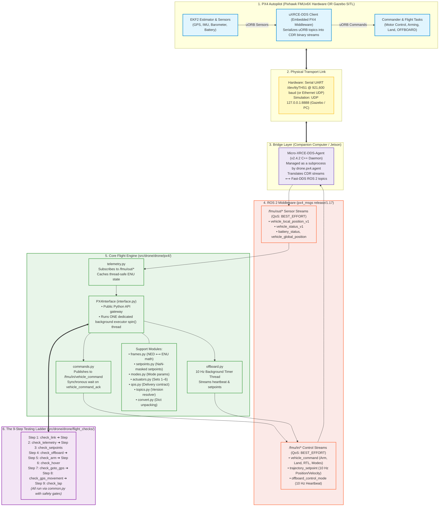

# System Architecture & Technical Deep-Dive

This document details the software and hardware architecture of `drone-2027`. It explains how the companion computer (NVIDIA Jetson or simulated workstation) interfaces with the PX4 Autopilot through the **uXRCE-DDS bridge**, how ROS 2 manages flight data, and exactly what each file in the repository is responsible for.

---

## 1. System Architecture Overview

The diagram below expands on the official PX4 uXRCE-DDS architecture, showing the linear flow from hardware flight sensors, through the serial/UDP transport and DDS bridge, into our ROS 2 flight engine, and up to the 9-step flight verification ladder:

### System Architecture Flowchart



---

## 2. ASCII Architecture & File Responsibility Directory

This section details **exactly what each file in the repository takes care of**, what topics it interacts with, and what functions it provides.

```text
========================================================================================================================
                                    STAGE 1: PX4 AUTOPILOT (FIRMWARE v1.17.0)
  Runs on Pixhawk FMUv6X microcontroller (Hardware) OR px4_sitl process (Gazebo Simulation)
  Coordinates: Aviation NED (North-East-Down, -Z is Up) | Internal Bus: uORB
========================================================================================================================
   [Flight Sensors & EKF2]              [Commander & Flight Modes]             [Flight Task Offboard]
   • GPS, IMU, Barometer, Mag           • Arming safety interlocks             • Trajectory tracking
   • Calculates metric position         • POSCTL, AUTO.LOITER, RTL             • Velocity & position PIDs
              │                                      ▲                                    ▲
              ▼                                      │                                    │
   Outbound uORB Topics:               Inbound uORB Topic:                   Inbound uORB Topics:
   • vehicle_status_v1                 • vehicle_command                     • trajectory_setpoint
   • vehicle_local_position_v1           (VehicleCommand 187, 176, etc.)     • offboard_control_mode
   • battery_status                                                            (Must stream at >= 2 Hz)
   • vehicle_command_ack
              │                                      ▲                                    ▲
              └──────────────────────────────┬───────┴────────────────────────────────────┘
                                             ▼
                             ┌──────────────────────────────┐
                             │    uXRCE-DDS Client (PX4)    │
                             │ Encodes uORB structs to CDR  │
                             └──────────────┬───────────────┘
============================================│===========================================================================
                               STAGE 2: PHYSICAL TRANSPORT LAYER
   • Hardware Link: Serial UART cable (/dev/ttyTHS1 @ 921,600 baud) or Ethernet UDP
   • Simulation Link: UDP localhost:8888 (Gazebo / PC)
============================================│===========================================================================
                                            ▼
┌──────────────────────────────────────────────────────────────────────────────────────────────────────────────────────┐
│                            STAGE 3: COMPANION COMPUTER (NVIDIA JETSON / LINUX)                                       │
│                                                                                                                      │
│ ┌──────────────────────────────────────────────────────────────────────────────────────────────────────────────────┐ │
│ │ FILE: src/drone/drone/px4/agent.py                                                                               │ │
│ │ RESPONSIBILITY: Subprocess lifecycle manager for the external Micro-XRCE-DDS-Agent C++ binary.                   │ │
│ │ • Spawns: `MicroXRCEAgent serial --dev /dev/ttyTHS1 -b 921600` OR `MicroXRCEAgent udp4 -p 8888`                  │ │
│ │ • Parses CLI flags: `--sitl`, `--serial [DEV]`, `--baud [BAUD]`, `--udp [PORT]`, `--no-agent`                    │ │
│ │ • Exposes: add_link_args(parser), start_agent_from_args(args), stop_agent()                                      │ │
│ └──────────────────────────────────────────────────────────┬───────────────────────────────────────────────────────┘ │
│                                                            ▼                                                         │
│ ┌──────────────────────────────────────────────────────────────────────────────────────────────────────────────────┐ │
│ │ ROS 2 DDS MIDDLEWARE (Fast-DDS & px4_msgs release/1.17 submodule)                                                │ │
│ │                                                                                                                  │ │
│ │ ┌──────────────────────────────────────────────────────────────────────────────────────────────────────────────┐ │ │
│ │ │ FILE: src/drone/drone/px4/qos.py                                                                             │ │ │
│ │ │ RESPONSIBILITY: Defines the DDS delivery contract (PX4_QOS).                                                 │ │ │
│ │ │ • Policy: BEST_EFFORT + TRANSIENT_LOCAL + KEEP_LAST (depth=1).                                               │ │ │
│ │ │ • Why: Matches PX4 sensor streams; prevents silent subscriber drops caused by ROS 2 default RELIABLE policy.│ │ │
│ │ └──────────────────────────────────────────────────────────────────────────────────────────────────────────────┘ │ │
│ │ ┌──────────────────────────────────────────────────────────────────────────────────────────────────────────────┐ │ │
│ │ │ FILE: src/drone/drone/px4/topics.py                                                                          │ │ │
│ │ │ RESPONSIBILITY: Resolves dynamic topic names based on px4_msgs MESSAGE_VERSION attributes.                   │ │ │
│ │ │ • Why: PX4 1.17 bumped VehicleLocalPosition version to 1, publishing on /fmu/out/vehicle_local_position_v1.   │ │ │
│ │ │ • Exposes: in_topic(msg_type, name), out_topic(msg_type, name)                                               │ │ │
│ │ └──────────────────────────────────────────────────────────────────────────────────────────────────────────────┘ │ │
│ └────────────────────────────┬────────────────────────────────────────────────────────▲──────────────────────────────┘ │
│                              │                                                        │                              │
│                              ▼ Inbound: /fmu/out/*                                    │ Outbound: /fmu/in/*          │
│ ═════════════════════════════╪════════════════════════════════════════════════════════╪═════════════════════════════ │
│                              │         STAGE 4: OUR CORE FLIGHT ENGINE                │                              │
│                              │              (src/drone/drone/px4/)                    │                              │
│                              │                                                        │                              │
│ ┌────────────────────────────┴────────────────────────────────────────────────────────┴─────────────────────────────┐ │
│ │ FILE: src/drone/drone/px4/interface.py                                                                            │ │
│ │ RESPONSIBILITY: The central API gateway class (PX4Interface) and single-threaded execution manager.                │ │
│ │ • Inherits from: rclpy.node.Node, TelemetryMixin, CommandsMixin, OffboardMixin                                    │ │
│ │ • The 2026 Threading Fix: Spawns EXACTLY ONE background daemon thread running SingleThreadedExecutor.spin(self). │ │
│ │   Guarantees no multi-threading race condition crashes in ROS 2; getters return cached state immediately.         │ │
│ │ • Exposes: init_px4(connect_timeout), shutdown_px4()                                                              │ │
│ └──────┬───────────────────────────────────────────┬───────────────────────────────────────────┬────────────────────┘ │
│        │                                           │                                           │                      │
│        ▼                                           ▼                                           ▼                      │
│ ┌───────────────────────────────┐ ┌─────────────────────────────────┐ ┌─────────────────────────────────────────────┐ │
│ │ FILE: px4/telemetry.py        │ │ FILE: px4/commands.py           │ │ FILE: px4/offboard.py                       │ │
│ │ RESPONSIBILITY: Inbound       │ │ RESPONSIBILITY: Outbound        │ │ RESPONSIBILITY: 10 Hz Dead-man's            │ │
│ │ sensor subscriptions & state  │ │ vehicle command & ack execution.│ │ heartbeat and setpoint streaming.           │ │
│ │ caching.                      │ │                                 │ │                                             │ │
│ │ • Reads:                      │ │ • Writes:                       │ │ • Writes (10 Hz Background Timer):          │ │
│ │   /fmu/out/vehicle_status_v1  │ │   /fmu/in/vehicle_command       │ │   /fmu/in/offboard_control_mode             │ │
│ │   /fmu/out/vehicle_local_pos  │ │ • Reads:                        │ │   /fmu/in/trajectory_setpoint               │ │
│ │   /fmu/out/battery_status     │ │   /fmu/out/vehicle_command_ack  │ │ • Methods:                                  │ │
│ │   /fmu/out/vehicle_global_pos │ │ • Handshake: Blocks caller on   │ │   start_offboard_stream_background()        │ │
│ │ • Exposes Getters:            │ │   unique threading.Event until  │ │   stop_offboard_stream_background()         │ │
│ │   get_location()              │ │   PX4 accepts the command.      │ │   start_offboard()                          │ │
│ │   get_velocity()              │ │ • Methods:                      │ │   send_position_setpoint(x, y, z, yaw)      │ │
│ │   get_battery_status()        │ │   arm_vehicle(timeout)          │ │   send_velocity_setpoint(vx, vy, vz, yaw)   │ │
│ │   get_gps_location()          │ │   disarm_vehicle()              │ │   hold_current_position()                   │ │
│ │   is_armed(), get_mode()      │ │   takeoff(altitude), land()     │ │ • Failsafe: Prevents COM_OF_LOSS_T timeout  │ │
│ │   print_telemetry_health()    │ │   change_mode("RTL"), etc.      │ │   (which causes PX4 to drop to LOITER).     │ │
│ └──────────────┬────────────────┘ └────────────────┬────────────────┘ └──────────────────────┬──────────────────────┘ │
│                │                                   │                                         │                        │
│                ▼                                   ▼                                         ▼                        │
│ ┌───────────────────────────────┐ ┌─────────────────────────────────┐ ┌─────────────────────────────────────────────┐ │
│ │ FILE: px4/convert.py          │ │ FILE: px4/modes.py              │ │ FILE: px4/setpoints.py                      │ │
│ │ RESPONSIBILITY: Unpacks raw   │ │ RESPONSIBILITY: Translates mode │ │ RESPONSIBILITY: Constructs raw              │ │
│ │ PX4 structs into clean dicts. │ │ names and command integers.     │ │ TrajectorySetpoint message fields.          │ │
│ │ • Checks xy_valid, z_valid.   │ │ • Translates "OFFBOARD", "RTL", │ │ • Performs NaN-masking for unconstrained    │ │
│ │ • Decodes GPS fix types.      │ │   "AUTO.LOITER", "LAND".        │ │   axes (e.g. pure horizontal velocity).     │ │
│ └──────────────┬────────────────┘ │ • Verifies MAV_CMD IDs at boot. │ └──────────────────────┬──────────────────────┘ │
│                │                  └────────────────┬────────────────┘                        │                        │
│                ▼                                   ▼                                         ▼                        │
│ ┌───────────────────────────────┐ ┌─────────────────────────────────┐ ┌─────────────────────────────────────────────┐ │
│ │ FILE: px4/frames.py           │ │ FILE: px4/actuators.py          │ │ (Uses frames.py for ENU -> NED conversion)  │ │
│ │ RESPONSIBILITY: Pure math for │ │ RESPONSIBILITY: Maps Actuator   │ └─────────────────────────────────────────────┘ │
│ │ coordinate conversions.       │ │ Sets 1–6 (MAV_CMD 187).         │                                                 │
│ │ • NED ⟷ ENU position math     │ │ • Replaces old DO_SET_SERVO.    │                                                 │
│ │ • Quaternion ⟷ Euler angles   │ │ • Clamps -1.0 to +1.0 PWM inputs│                                                 │
│ │ • Heading yaw wrapping        │ │   for sprayers and payload drop.│                                                 │
│ └───────────────────────────────┘ └─────────────────────────────────┘                                                 │
└────────────────────────────────────────────────┬──────────────────────────────────────────────────────────────────────┘
                                                 │
                                                 ▼
=========================================================================================================================
                               STAGE 5: THE 9-STEP VERIFICATION LADDER
                                     (src/drone/drone/flight_checks/)
=========================================================================================================================
 ┌─────────────────────────────────────────────────────────────────────────────────────────────────────────────────────┐
 │ FILE: flight_checks/common.py                                                                                       │
 │ RESPONSIBILITY: Shared CLI argument parsing, PX4 connection initialization, safe arming logic, and clean shutdown. │
 │ • build_parser(): Configures link flags and safety parameters (--api, --sitl, --serial, --baud, --udp).            │
 │ • connect(args): Starts MicroXRCEAgent, initializes PX4Interface, and confirms topic reception.                     │
 │ • arm(px4, args): Enforces safety: requires physical RC switch on real drone; permits code arming only with --sitl.│
 │ • run_main(check_fn, args): Wraps checks in try/finally to guarantee agent shutdown and ROS node destruction.      │
 └───────────────────────────────────────────────────┬─────────────────────────────────────────────────────────────────┘
                                                     │
        ┌────────────────────────────────────────────┴────────────────────────────────────────────┐
        │                                                                                         │
        ▼                                                                                         ▼
 [BENCH CHECKS: Steps 1–5]                                                                 [FLIGHT CHECKS: Steps 6–9]
 1. check_link.py:          Bridge health (counts publishers)                              6. check_hover.py:        Takeoff to 3m, 10s hover, land
 2. check_telemetry.py:     Sensor verification (GPS, EKF, battery)                        7. check_goto_gps.py:     Fly to single GPS coordinate
 3. check_setpoints.py:     Math sanity test (dry-run setpoints)                           8. check_gps_movement.py: Sequential waypoints + yaw
 4. check_offboard.py:      10 Hz heartbeat handshake verification                         9. check_lap.py:          Full perimeter lap + RTL
 5. check_arm.py:           Motor interlock test (PROPS OFF!)
```

---

## 3. Coordinate Transformations (`frames.py`)

Aviation autopilots and robotics software use different physical conventions. `drone-2027` isolates all conversions to [`src/drone/drone/px4/frames.py`](file:///Users/benmochen/SynologyDrive/Programming/McGill%20Robotics/drone-2027/src/drone/drone/px4/frames.py):

* **NED (North, East, Down):** Native PX4 aviation coordinate frame.
  * $+X$ points North
  * $+Y$ points East
  * $+Z$ points Down towards the center of the Earth (Altitude is $-Z$)
  * Yaw is $0^\circ$ facing North, rotating clockwise ($+90^\circ$ East).
* **ENU (East, North, Up):** Standard ROS 2 robotics frame (REP 103).
  * $+X$ points East
  * $+Y$ points North
  * $+Z$ points Up into the sky (Altitude is $+Z$)
  * Yaw is $0^\circ$ facing East, rotating counter-clockwise ($+90^\circ$ North).

### Exact Conversion Formulas

```text
Position Conversion:
-------------------------------------------------------------
East  (X_enu) =  North (Y_ned)
North (Y_enu) =  East  (X_ned)
Up    (Z_enu) = -Down  (Z_ned)

Velocity Conversion:
-------------------------------------------------------------
Vx_enu =  Vy_ned
Vy_enu =  Vx_ned
Vz_enu = -Vz_ned

Yaw / Heading Conversion:
-------------------------------------------------------------
Yaw_enu = 90° - Heading_ned   (normalized to [-π, +π])

Yaw Rate Conversion:
-------------------------------------------------------------
YawRate_enu = -YawRate_ned    (counter-clockwise vs. clockwise)
```

---

## 4. Detailed Data Flow Pipelines

### Pipeline A: Inbound Telemetry Flow (Sensor to Python Getter)

```text
[Pixhawk IMU / GPS / Barometer]
         │ (Physical sensor interrupts on microcontroller)
         ▼
[PX4 Autopilot: EKF2 State Estimator]
         │ (Publishes internal uORB topic: vehicle_local_position)
         ▼
[PX4 uXRCE-DDS Client]
         │ (Encodes into CDR binary stream over Serial UART / UDP)
         ▼
[MicroXRCEAgent (Fast-DDS Bridge)]
         │ (Translates to ROS 2 topic: /fmu/out/vehicle_local_position_v1)
         ▼
[PX4Interface: Dedicated Executor Spin Thread]
         │ (Dispatches to TelemetryMixin._local_position_callback)
         ▼
[drone.px4.convert.local_position_enu()]
         │ (Validates xy_valid, converts NED -> ENU coordinates)
         ▼
[Self-Cached Dict: self._telemetry_cache["local_position"]]
         ▲
         │ (Instant, non-blocking read from any thread)
[Caller: px4.get_location()]
```

---

### Pipeline B: Outbound Command Execution Flow (Synchronous Handshake)

```text
[Caller / Flight Check Script: px4.arm_vehicle(timeout=20)]
         │
         ▼
[CommandsMixin._send_command_sync(CMD_ARM)]
         │ 1. Registers threading.Event in _ack_waiters[ARM_ID]
         │ 2. Publishes VehicleCommand to /fmu/in/vehicle_command
         ▼
[MicroXRCEAgent] ──(Serial / UDP)──> [PX4 uXRCE-DDS Client]
                                              │
                                              ▼
                                   [PX4 Commander Module]
                                   • Validates safety interlocks
                                   • Arms ESCs / Motors
                                   • Emits vehicle_command_ack (Result: ACCEPTED = 0)
                                              │
[CommandsMixin._ack_callback()] <─────────────┘
  │ (Received by background spin thread)
  │
  ├─ Matches command_id == ARM_ID
  └─ Sets threading.Event and stores Result code
         │
         ▼
[Caller Unblocks: returns True (Armed)]
```

---

### Pipeline C: 10 Hz OFFBOARD Heartbeat Loop

```text
[OffboardMixin.start_offboard_stream_background()]
         │
         ▼
[Background Timer Thread: 10 Hz Loop (Every 100ms)]
         │
         ├─ Reads active target from self._current_target
         │
         ├─ setpoints.position_setpoint(x, y, z, yaw)
         │    └─ Converts target ENU -> NED
         │    └─ Masks unconstrained velocity/acceleration axes with NaN
         │
         ├─ Publishes TrajectorySetpoint to /fmu/in/trajectory_setpoint
         │
         └─ Publishes OffboardControlMode (position=True, velocity=False)
              to /fmu/in/offboard_control_mode
         │
         ▼
[PX4 Flight Task Offboard]
   • Receives heartbeat within COM_OF_LOSS_T (< 1.0s)
   • Executes smooth trajectory tracking to the commanded waypoint
```
