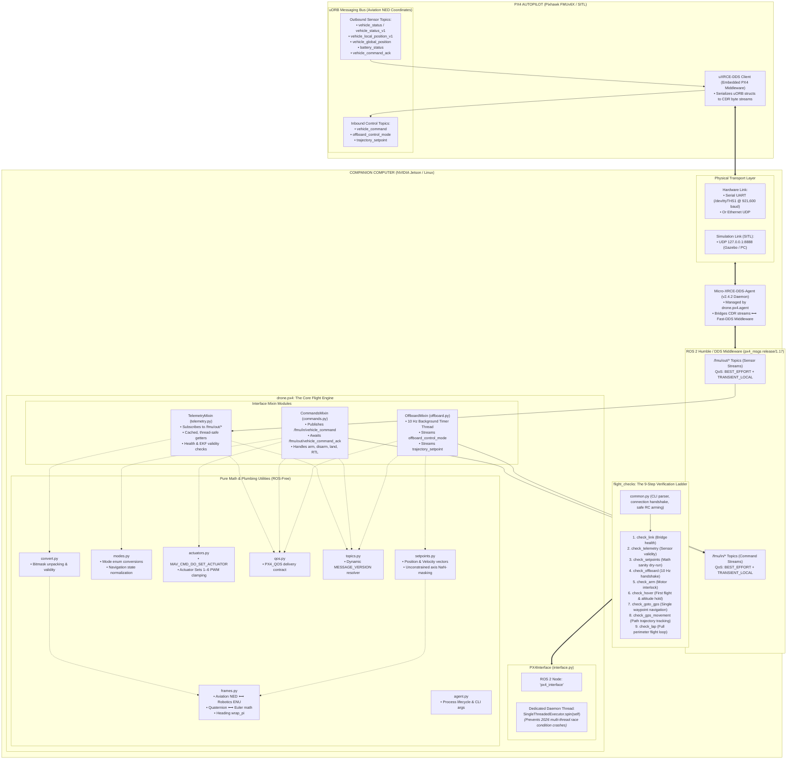

# System Architecture & Technical Deep-Dive

This document details the software and hardware architecture of `drone-2027`. It explains how the companion computer (NVIDIA Jetson or simulated workstation) interfaces with the PX4 Autopilot through the **uXRCE-DDS bridge**, how ROS 2 manages flight data, and how each component in `src/drone/drone/px4/` operates from first principles.

---

## 1. System Architecture Overview

The diagram below expands on the official PX4 uXRCE-DDS architecture, mapping every physical layer, communication bridge, internal message topic, Python class, and verification script in our repository:

### Mermaid Interactive Architecture Diagram



---

### ASCII System Architecture Blueprint

```text
┌────────────────────────────────────────────────────────────────────────────────────────┐
│                                   PX4 AUTOPILOT                                        │
│  (Pixhawk FMUv6X hardware running PX4 v1.17.0 firmware OR px4_sitl in Gazebo)          │
│                                                                                        │
│  uORB Topics (Aviation NED coordinates):                                              │
│    OUTBOUND (Sensors & State):                 INBOUND (Commands & Setpoints):         │
│    • vehicle_status / vehicle_status_v1        • vehicle_command                       │
│    • vehicle_local_position_v1                 • offboard_control_mode                 │
│    • vehicle_global_position                   • trajectory_setpoint                   │
│    • battery_status                                                                    │
│    • vehicle_command_ack                                                               │
│                           ▲                              │                             │
│                           │                              ▼                             │
│  ┌──────────────────────────────────────────────────────────────┐                      │
│  │                    uXRCE-DDS Client (PX4)                    │                      │
│  │   Serializes uORB structs to CDR byte streams over link      │                      │
│  └──────────────────────────────────────────────────────────────┘                      │
└─────────────────────────────────┬──────────────────────────────────────────────────────┘
                                  │
                   Physical Transport Layer
       Hardware: Serial UART (/dev/ttyTHS1 @ 921600 baud) or Ethernet UDP
       Simulation (SITL): UDP 127.0.0.1:8888
                                  │
┌─────────────────────────────────▼──────────────────────────────────────────────────────┐
│                  COMPANION COMPUTER (NVIDIA Jetson / Linux Workstation)                │
│                                                                                        │
│  ┌──────────────────────────────────────────────────────────────┐                      │
│  │             Micro-XRCE-DDS-Agent (v2.4.2 C++ Daemon)         │                      │
│  │     Managed & auto-spawned by drone.px4.agent                │                      │
│  │     Bridges CDR byte streams ⟷ Fast-DDS topics              │                      │
│  └──────────────────────────────┬───────────────────────────────┘                      │
│                                 │ Fast-DDS Middleware                                  │
│                                 ▼                                                      │
│  ┌──────────────────────────────────────────────────────────────┐                      │
│  │                     ROS 2 Middleware                         │                      │
│  │   px4_msgs (release/1.17 submodule): Python/C++ msg structs  │                      │
│  │   Topics: /fmu/out/* (Sensor Streams)                        │                      │
│  │   Topics: /fmu/in/*  (Command & Setpoint Streams)            │                      │
│  │   QoS: BEST_EFFORT + TRANSIENT_LOCAL (from drone.px4.qos)    │                      │
│  └──────────────────────────────┬───────────────────────────────┘                      │
│                                 │                                                      │
│  ═══════════════════════════════╪════════════════════════════════════════════════════  │
│                                 │                                                      │
│  OUR PYTHON ROS 2 FLIGHT ENGINE (src/drone/drone/px4/)                                 │
│                                                                                        │
│  ┌──────────────────────────────────────────────────────────────────────────────────┐  │
│  │ PX4Interface (interface.py) [Inherits Node + Telemetry + Commands + Offboard]    │  │
│  │                                                                                  │  │
│  │  ┌────────────────────────────────────────────────────────────────────────────┐  │  │
│  │  │ Dedicated Daemon Spin Thread: SingleThreadedExecutor.spin(self)            │  │  │
│  │  │ (Prevents drone-2026 multi-thread race condition crashes)                  │  │  │
│  │  └────────────────────────────────────────────────────────────────────────────┘  │  │
│  │                                                                                  │  │
│  │  ┌─────────────────────────┐  ┌───────────────────────┐  ┌────────────────────┐  │  │
│  │  │ TelemetryMixin          │  │ CommandsMixin         │  │ OffboardMixin      │  │  │
│  │  │ (telemetry.py)          │  │ (commands.py)         │  │ (offboard.py)      │  │  │
│  │  │                         │  │                       │  │                    │  │  │
│  │  │ Reads:                  │  │ Writes:               │  │ Writes (10 Hz):    │  │  │
│  │  │  • /fmu/out/*           │  │  • /fmu/in/           │  │  • /fmu/in/        │  │  │
│  │  │ QoS: PX4_QOS (qos.py)   │  │    vehicle_command    │  │    offboard_       │  │  │
│  │  │ Dynamic topics.py       │  │ Reads:                │  │    control_mode    │  │  │
│  │  │                         │  │  • /fmu/out/          │  │  • /fmu/in/        │  │  │
│  │  │ Transforms via:         │  │    vehicle_command_ack│  │    trajectory_     │  │  │
│  │  │  • convert.py           │  │                       │  │    setpoint        │  │  │
│  │  │  • frames.py (NED->ENU) │  │ Uses:                 │  │                    │  │  │
│  │  │                         │  │  • modes.py           │  │ Streams via:       │  │  │
│  │  │ Exposes safe getters:   │  │  • actuators.py       │  │  • setpoints.py    │  │  │
│  │  │  get_location()         │  │                       │  │  • frames.py       │  │  │
│  │  │  get_gps_location()     │  │ Methods:              │  │    (ENU->NED)      │  │  │
│  │  │  get_battery_status()   │  │  arm_vehicle()        │  │                    │  │  │
│  │  │  is_armed(), etc.       │  │  disarm_vehicle()     │  │ Methods:           │  │  │
│  │  │                         │  │  takeoff(), land()    │  │  start_offboard()  │  │  │
│  │  │                         │  │  change_mode("RTL")   │  │  send_velocity_... │  │  │
│  │  │                         │  │  set_actuator()       │  │  send_position_... │  │  │
│  │  └────────────▲────────────┘  └───────────▲───────────┘  └─────────▲──────────┘  │  │
│  └───────────────┼───────────────────────────┼────────────────────────┼─────────────┘  │
│                  │                           │                        │                │
│  ════════════════╪═══════════════════════════╪════════════════════════╪══════════════  │
│                  │                           │                        │                │
│  THE 9-STEP TESTING LADDER (src/drone/drone/flight_checks/)                            │
│                                                                                        │
│  ┌──────────────────────────────────────────────────────────────────────────────────┐  │
│  │ common.py: build_parser(), connect(args), run_main(check, args), arm(), shutdown│  │
│  └───────────────────────────────────────────┬──────────────────────────────────────┘  │
│                                              │                                         │
│   Step 1: check_link            Step 4: check_offboard        Step 7: check_goto_gps   │
│   Step 2: check_telemetry       Step 5: check_arm             Step 8: check_gps_mov... │
│   Step 3: check_setpoints       Step 6: check_hover           Step 9: check_lap        │
└────────────────────────────────────────────────────────────────────────────────────────┘
```

---

## 2. Component-by-Component Deep-Dive (`drone.px4`)

### `interface.py` — The Public Gateway & Threading Model
* **Role:** Constructs the composite `PX4Interface` class inheriting from `Node`, `TelemetryMixin`, `CommandsMixin`, and `OffboardMixin`.
* **The Threading Fix Over 2026:**
  In `drone-2026`, multiple arbitrary Python threads concurrently called `rclpy.spin_once()`, which corrupted the ROS 2 internal state and resulted in frequent deadlocks and hard crashes.
  In `drone-2027`, `interface.py` starts **exactly one dedicated background daemon thread** running `SingleThreadedExecutor().spin()`. All ROS 2 callbacks execute sequentially inside this single worker thread. High-level callers interact via thread-safe getter methods that immediately return the freshest cached state.

### `telemetry.py` — Sensor Streaming & EKF Health
* **Role:** Subscribes to all incoming sensor topics under `/fmu/out/*`.
* **Subscribed Streams:**
  - `VehicleStatus` (`/fmu/out/vehicle_status` or `vehicle_status_v1`): Arming state, flight mode, navigation state.
  - `VehicleLocalPosition` (`/fmu/out/vehicle_local_position_v1`): Local metric coordinates ($x, y, z$) and velocities ($v_x, v_y, v_z$).
  - `VehicleGlobalPosition` (`/fmu/out/vehicle_global_position`): GPS coordinates (Latitude, Longitude, Altitude AMSL).
  - `SensorGps` (`/fmu/out/vehicle_gps_position`): GPS satellite count, fix type (3D fix, RTK).
  - `BatteryStatus` (`/fmu/out/battery_status`): Voltage, current draw, remaining battery fraction.
  - `VehicleLandDetected` (`/fmu/out/vehicle_land_detected`): Ground contact and landing flags.
* **Safety & Health:** Provides `print_telemetry_health()` to verify that the EKF has a valid estimate before arming.

### `commands.py` — Vehicle Commands & Synchronous Ack
* **Role:** Publishes commands to `/fmu/in/vehicle_command` (such as Arm, Disarm, Land, RTL, Takeoff, and Mode Switch) and listens for responses on `/fmu/out/vehicle_command_ack`.
* **The Command Handshake:**
  PX4 uses a synchronous command-ack protocol. When `send_command()` is called:
  1. A unique `threading.Event` is registered in `_ack_waiters[command_id]`.
  2. The `VehicleCommand` message is published.
  3. The caller blocks on `event.wait(timeout)` until the background spin thread receives the corresponding `VehicleCommandAck` from PX4.
  4. Returns `True` only if PX4 replied with `VEHICLE_CMD_RESULT_ACCEPTED` (0).

### `offboard.py` — 10 Hz OFFBOARD Heartbeat Stream
* **Role:** Manages the offboard control state and streams setpoints.
* **The Dead-Man's Switch Requirement:**
  PX4 enforces a safety rule: to switch into or stay in `OFFBOARD` mode, the flight controller must receive an active stream of `OffboardControlMode` and `TrajectorySetpoint` messages at **at least 2 Hz**. If this stream pauses for longer than `COM_OF_LOSS_T` (default: 1.0 second), PX4 immediately triggers a failsafe and drops back into `POSCTL` or `AUTO.LOITER`.
* **Implementation:** `OffboardMixin` maintains an independent 10 Hz background streaming thread that continuously publishes the current target setpoint.

### `frames.py` — Coordinate Transformations
* **Role:** Pure mathematics converting between aviation and robotics coordinate systems.
* **The Two Frames:**
  - **NED (North, East, Down):** The native aviation convention used internally by PX4 firmware. $+x$ is North, $+y$ is East, $+z$ is Down towards the Earth. Positive yaw rotates clockwise looking down.
  - **ENU (East, North, Up):** The standard robotics convention (REP 103) used by ROS 2 and all our high-level logic. $+x$ is East, $+y$ is North, $+z$ is Up into the sky. Positive yaw rotates counter-clockwise.
* **Conversions:**
  $$\begin{bmatrix} x_{\text{ENU}} \\ y_{\text{ENU}} \\ z_{\text{ENU}} \end{bmatrix} = \begin{bmatrix} y_{\text{NED}} \\ x_{\text{NED}} \\ -z_{\text{NED}} \end{bmatrix}, \quad \text{Yaw}_{\text{ENU}} = \frac{\pi}{2} - \text{Yaw}_{\text{NED}}$$

### `setpoints.py` — Trajectory Setpoint Formatting
* **Role:** Constructs valid `TrajectorySetpoint` messages from position or velocity targets.
* **NaN-Masking:** PX4 interprets `NaN` (Not a Number) as "unconstrained / do not control this axis". For example, when commanding pure horizontal velocity ($v_x, v_y$) while holding altitude, `setpoints.py` automatically sets position axes and acceleration axes to `NaN`.

### `qos.py` — DDS Quality of Service Profile
* **Role:** Defines `PX4_QOS`, the exact DDS communication contract needed to talk to PX4.
* **The Profile:**
  - `ReliabilityPolicy.BEST_EFFORT`: Matches PX4's high-speed sensor streams (prevents retransmission stalls and silent subscriber disconnection).
  - `DurabilityPolicy.TRANSIENT_LOCAL`: Ensures our node immediately receives the last-published status message even if PX4 published it before our Python script launched.
  - `HistoryPolicy.KEEP_LAST, depth=1`: Keeps only the single freshest message, discarding stale historical packets.

### `topics.py` — Dynamic Topic Version Resolver
* **Role:** Dynamically inspects `MESSAGE_VERSION` on `px4_msgs` classes.
* **Why It Matters:** In PX4 v1.17, `VehicleLocalPosition` incremented its message version to 1, causing PX4 to publish on `/fmu/out/vehicle_local_position_v1`. `topics.py` dynamically appends `_v1` when required, ensuring automatic compatibility across firmware updates.

### `agent.py` — MicroXRCEAgent Process Manager
* **Role:** Manages the lifecycle of the external `MicroXRCEAgent` binary as a Python subprocess.
* **CLI Flags:**
  - `--sitl`: Connects via UDP to `127.0.0.1:8888`.
  - `--serial [DEV] --baud [BAUD]`: Connects via physical UART (default `/dev/ttyTHS1` at 921,600 baud).
  - `--udp [PORT]`: Connects over Ethernet UDP.
  - `--no-agent`: Bypasses launching an agent if one is already running in an external terminal.

### `actuators.py` — Peripheral Actuator Mapping
* **Role:** Replaces deprecated MAVLink servo commands (`MAV_CMD_DO_SET_SERVO`) with modern PX4 Actuator Sets (`MAV_CMD_DO_SET_ACTUATOR`, 187).
* **Slots:** Maps normalized values ($-1.0$ to $+1.0$) across Actuator Sets 1 through 6 for sprayers, payload drop servos, and gimbal tilt/pan.

### `convert.py` — Struct Decoding & Validity Filtering
* **Role:** Unpacks raw ROS message objects into clean Python dictionaries. Checks sensor flags (e.g. `xy_valid`, `z_valid`) and returns `None` if the flight controller's state estimate has not converged.

---

## 3. Detailed Data Flow Pipelines

### Pipeline A: Inbound Telemetry Flow (Sensor to Python Getter)

```text
[Pixhawk IMU / GPS / Baro]
         │ (Hardware sensor interrupts)
         ▼
[PX4 Autopilot: EKF2 State Estimator]
         │ (Publishes internal uORB topic: vehicle_local_position)
         ▼
[PX4 uXRCE-DDS Client]
         │ (Encodes into CDR binary stream over Serial UART / UDP)
         ▼
[MicroXRCEAgent (Fast-DDS Bridge)]
         │ (Translates to ROS 2 topic: /fmu/out/vehicle_local_position_v1)
         ▼
[PX4Interface: Dedicated Executor Spin Thread]
         │ (Dispatches to TelemetryMixin._local_position_callback)
         ▼
[drone.px4.convert.local_position_enu()]
         │ (Validates xy_valid, converts NED -> ENU coordinates)
         ▼
[Self-Cached Dict: self._telemetry_cache["local_position"]]
         ▲
         │ (Instant, non-blocking read)
[Caller: px4.get_location()]
```

---

### Pipeline B: Outbound Command Execution Flow (Synchronous Handshake)

```text
[Caller / Flight Check Script: px4.arm_vehicle(timeout=20)]
         │
         ▼
[CommandsMixin._send_command_sync(CMD_ARM)]
         │ 1. Registers threading.Event in _ack_waiters[ARM_ID]
         │ 2. Publishes VehicleCommand to /fmu/in/vehicle_command
         ▼
[MicroXRCEAgent] ──(Serial / UDP)──> [PX4 uXRCE-DDS Client]
                                              │
                                              ▼
                                   [PX4 Commander Module]
                                   • Validates safety interlocks
                                   • Arms ESCs / Motors
                                   • Emits vehicle_command_ack (Result: ACCEPTED = 0)
                                              │
[CommandsMixin._ack_callback()] <─────────────┘
  │ (Received by background spin thread)
  │
  ├─ Matches command_id == ARM_ID
  └─ Sets threading.Event and stores Result code
         │
         ▼
[Caller Unblocks: returns True (Armed)]
```

---

### Pipeline C: 10 Hz OFFBOARD Heartbeat Loop

```text
[OffboardMixin.start_offboard_stream_background()]
         │
         ▼
[Background Timer Thread: 10 Hz Loop (Every 100ms)]
         │
         ├─ Reads active target from self._current_target
         │
         ├─ setpoints.position_setpoint(x, y, z, yaw)
         │    └─ Converts target ENU -> NED
         │    └─ Masks unconstrained velocity/acceleration axes with NaN
         │
         ├─ Publishes TrajectorySetpoint to /fmu/in/trajectory_setpoint
         │
         └─ Publishes OffboardControlMode (position=True, velocity=False)
              to /fmu/in/offboard_control_mode
         │
         ▼
[PX4 Flight Task Offboard]
   • Receives heartbeat within COM_OF_LOSS_T (< 1.0s)
   • Executes smooth trajectory tracking to the commanded waypoint
```
